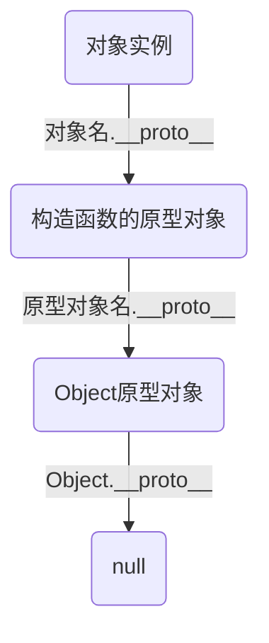

---
categories:
- 测试
date: 2022-05-18T18:07:59+0800
description: 测试博客功能用的文件.
draft: false
lastmod: 2022-05-18T18:07:59+0800
mermaid: true
title: 基准测试文件
---

# 测试

---

就像我说的那样,这是一个测试文件.

> 引用块测试
>
> > 二级引用块测试

- 无序列表
- 1
- 2
  - 二级无序
  - 1
  - 2
    - 三级无序
    - 1
    - 2

1. 有序列表
2. 2
3. 3


## 代码测试

```C#
using System;
namespace HelloWorldApplication
{
    /* 类名为 HelloWorld */
    class HelloWorld
    {
        /* main函数 */
        static void Main(string[] args)
        {
            /* 我的第一个 C# 程序 */
            Console.WriteLine("Hello World!");
            Console.ReadKey();
        }
    }
}
<!DOCTYPE html>
<html>
<head>
<meta charset="utf-8">
<title>菜鸟教程(runoob.com)</title>
</head>
<body>
    <h1>我的第一个标题</h1>
    <p>我的第一个段落。</p>
</body>
</html>
function $initHighlight(block, cls) {
  try {
    if (cls.search(/\bno\-highlight\b/) != -1)
      return process(block, true, 0x0F) +
             ` class="${cls}"`;
  } catch (e) {
    /* handle exception */
  }
  for (var i = 0 / 2; i < classes.length; i++) {
    if (checkCondition(classes[i]) === undefined)
      console.log('undefined');
  }

  return (
    <div>
      <web-component>{block}</web-component>
    </div>
  )
}

export  $initHighlight;
```


## 公式测试

$\sqrt{3x-1}+(1+x)^2$
$$
\begin{Bmatrix}
   a & b \\
   c & d
\end{Bmatrix}
$$


$$
\begin{aligned}
\sqrt{37} & = \sqrt{\frac{73^2-1}{12^2}} \\
 & = \sqrt{\frac{73^2}{12^2}\cdot\frac{73^2-1}{73^2}} \\ 
 & = \sqrt{\frac{73^2}{12^2}}\sqrt{\frac{73^2-1}{73^2}} \\
 & = \frac{73}{12}\sqrt{1 - \frac{1}{73^2}} \\ 
 & \approx \frac{73}{12}\left(1 - \frac{1}{2\cdot73^2}\right)
\end{aligned}
$$


## 表格测试

| Option | Description                                                  |
| ------ | :----------------------------------------------------------- |
| data   | path to data files to supply the data that will be passed into templates. |
| engine | engine to be used for processing templates. Handlebars is the default. |

## 图片测试


## 链接测试

[链接测试](https://github.com/markdown-it/markdown-it-abbr)

## html 语句测试


使用 <kbd>Ctrl</kbd>+<kbd>Alt</kbd>+<kbd>Del</kbd> 重启电脑


## kbd测试

[[ctrl]]+[[win]]

## 流程图测试



## 提示框测试

> [!CAUTION]
> Advises about risks or negative outcomes of certain actions.

## 管理员模式测试

请求访问权限...  <span class="secret-placeholder" data-id="9da91339e01196b74cb654f32fd5553b16d6490693551ec8273f9d1cb82bf1f3"></span>

<span class="secret-placeholder" data-id="cde61e8b44fa294450a5224eb85621ba45494760050cecaec09e99ed88710a58"></span>


# 目录测试

---

# 一级标题

## 二级标题


### 三级标题

#### 四级标题

##### 五级标题


# 大型目录测试

## 测试

## 测试

## 测试

## 测试

## 测试

## 测试

## 测试

## 测试

## 测试

## 测试

## 测试

## 测试

## 测试

## 测试

## 测试

## 测试

## 测试

## 测试

## 测试

## 测试

## 测试

## 测试

## 测试

## 测试

## 测试

## 测试

## 测试

## 测试

## 测试

## 测试

## 测试

## 测试

## 测试

## 测试

## 测试

## 测试

## 测试

## 测试

## 测试

## 测试

## 测试

## 测试

## 测试

## 测试## 测试

## 测试

## 测试

## 测试

## 测试

## 测试

## 测试

## 测试

## 测试

## 测试

## 测试

## 测试

## 测试

## 测试

## 测试

## 测试

## 测试

## 测试

## 测试

## 测试

## 测试

## 测试## 测试

## 测试

## 测试

## 测试

## 测试

## 测试

## 测试

## 测试

## 测试

## 测试

## 测试

## 测试

## 测试

## 测试

## 测试

## 测试

## 测试

## 测试

## 测试

## 测试

## 测试

## 测试## 测试

## 测试

## 测试

## 测试

## 测试

## 测试

## 测试

## 测试

## 测试

## 测试

## 测试

## 测试

## 测试

## 测试

## 测试

## 测试

## 测试

## 测试

## 测试

## 测试

## 测试

## 测试## 测试

## 测试

## 测试

## 测试

## 测试

## 测试

## 测试

## 测试

## 测试

## 测试

## 测试

## 测试

## 测试

## 测试

## 测试

## 测试

## 测试

## 测试

## 测试

## 测试

## 测试

## 测试## 测试

## 测试

## 测试

## 测试

## 测试

## 测试

## 测试

## 测试

## 测试

## 测试

## 测试

## 测试

## 测试

## 测试

## 测试

## 测试

## 测试

## 测试

## 测试

## 测试

## 测试

## 测试## 测试

## 测试

## 测试

## 测试

## 测试

## 测试

## 测试

## 测试

## 测试

## 测试

## 测试

## 测试

## 测试

## 测试

## 测试

## 测试

## 测试

## 测试

## 测试

## 测试

## 测试

## 测试## 测试

## 测试

## 测试

## 测试

## 测试

## 测试

## 测试

## 测试

## 测试

## 测试

## 测试

## 测试

## 测试

## 测试

## 测试

## 测试

## 测试

## 测试

## 测试

## 测试

## 测试

## 测试## 测试

## 测试

## 测试

## 测试

## 测试

## 测试

## 测试

## 测试

## 测试

## 测试

## 测试

## 测试

## 测试

## 测试

## 测试

## 测试

## 测试

## 测试

## 测试

## 测试

## 测试

## 测试## 测试

## 测试

## 测试

## 测试

## 测试

## 测试

## 测试

## 测试

## 测试

## 测试

## 测试

## 测试

## 测试

## 测试

## 测试

## 测试

## 测试

## 测试

## 测试

## 测试

## 测试

## 测试## 测试

## 测试

## 测试

## 测试

## 测试

## 测试

## 测试

## 测试

## 测试

## 测试

## 测试

## 测试

## 测试

## 测试

## 测试

## 测试

## 测试

## 测试

## 测试

## 测试

## 测试

## 测试## 测试

## 测试

## 测试

## 测试

## 测试

## 测试

## 测试

## 测试

## 测试

## 测试

## 测试

## 测试

## 测试

## 测试

## 测试

## 测试

## 测试

## 测试

## 测试

## 测试

## 测试

## 测试## 测试

## 测试

## 测试

## 测试

## 测试

## 测试

## 测试

## 测试

## 测试

## 测试

## 测试

## 测试

## 测试

## 测试

## 测试

## 测试

## 测试

## 测试

## 测试

## 测试

## 测试

## 测试## 测试

## 测试

## 测试

## 测试

## 测试

## 测试

## 测试

## 测试

## 测试

## 测试

## 测试

## 测试

## 测试

## 测试

## 测试

## 测试

## 测试

## 测试

## 测试

## 测试

## 测试

## 测试## 测试

## 测试

## 测试

## 测试

## 测试

## 测试

## 测试

## 测试

## 测试

## 测试

## 测试

## 测试

## 测试

## 测试

## 测试

## 测试

## 测试

## 测试

## 测试

## 测试

## 测试

## 测试## 测试

## 测试

## 测试

## 测试

## 测试

## 测试

## 测试

## 测试

## 测试

## 测试

## 测试

## 测试

## 测试

## 测试

## 测试

## 测试

## 测试

## 测试

## 测试

## 测试

## 测试

## 测试## 测试

## 测试

## 测试

## 测试

## 测试

## 测试

## 测试

## 测试

## 测试

## 测试

## 测试

## 测试

## 测试

## 测试

## 测试

## 测试

## 测试

## 测试

## 测试

## 测试

## 测试

## 测试## 测试

## 测试

## 测试

## 测试

## 测试

## 测试

## 测试

## 测试

## 测试

## 测试

## 测试

## 测试

## 测试

## 测试

## 测试

## 测试

## 测试

## 测试

## 测试

## 测试

## 测试

## 测试## 测试

## 测试

## 测试

## 测试

## 测试

## 测试

## 测试

## 测试

## 测试

## 测试

## 测试

## 测试

## 测试

## 测试

## 测试

## 测试

## 测试

## 测试

## 测试

## 测试

## 测试

## 测试

# 测试

## 测试

## 测试

## 测试

## 测试

## 测试

## 测试## 测试

## 测试

## 测试

## 测试

## 测试

## 测试

## 测试

## 测试

## 测试

## 测试

## 测试

## 测试

## 测试

## 测试

## 测试

## 测试

## 测试

## 测试

## 测试

## 测试

## 测试

## 测试## 测试

## 测试

## 测试

## 测试

## 测试

## 测试

## 测试

## 测试

## 测试

## 测试

## 测试

## 测试

## 测试

## 测试

## 测试

## 测试

## 测试

## 测试

## 测试

## 测试

## 测试

## 测试## 测试

## 测试

## 测试

## 测试

## 测试

## 测试

## 测试

## 测试

## 测试

## 测试

## 测试

## 测试

## 测试

## 测试

## 测试

## 测试

## 测试

## 测试

## 测试

## 测试

## 测试

## 测试